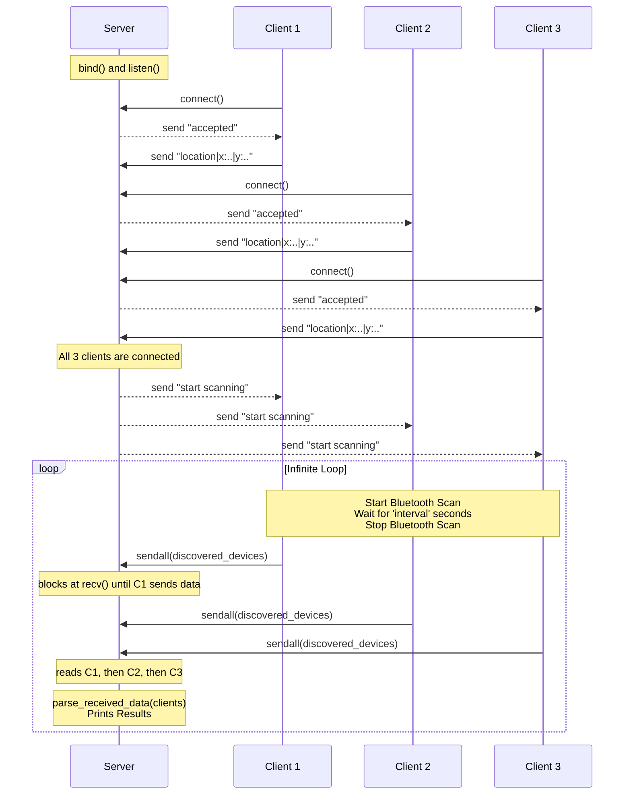

```mermaid
sequenceDiagram
    participant S as Server
    participant C1 as Client 1
    participant C2 as Client 2
    participant C3 as Client 3

    %% Handshake Phase
    Note over S: bind() and listen()
    C1->>S: connect()
    S-->>C1: send "accepted"
    C1->>S: send "location|x:..|y:.."
    
    C2->>S: connect()
    S-->>C2: send "accepted"
    C2->>S: send "location|x:..|y:.."

    C3->>S: connect()
    S-->>C3: send "accepted"
    C3->>S: send "location|x:..|y:.."

    %% Trigger Phase
    Note over S: All 3 clients are connected
    S-->>C1: send "start scanning"
    S-->>C2: send "start scanning"
    S-->>C3: send "start scanning"

    %% Scanning and Data Transmission Loop
    loop Infinite Loop
        Note over C1, C3: Start Bluetooth Scan<br/>Wait for 'interval' seconds<br/>Stop Bluetooth Scan
        
        C1->>S: sendall(discovered_devices)
        Note over S: blocks at recv() until C1 sends data
        C2->>S: sendall(discovered_devices)
        C3->>S: sendall(discovered_devices)
        
        Note over S: reads C1, then C2, then C3
        
        Note over S: parse_received_data(clients)<br/>Prints Results
    end
```
